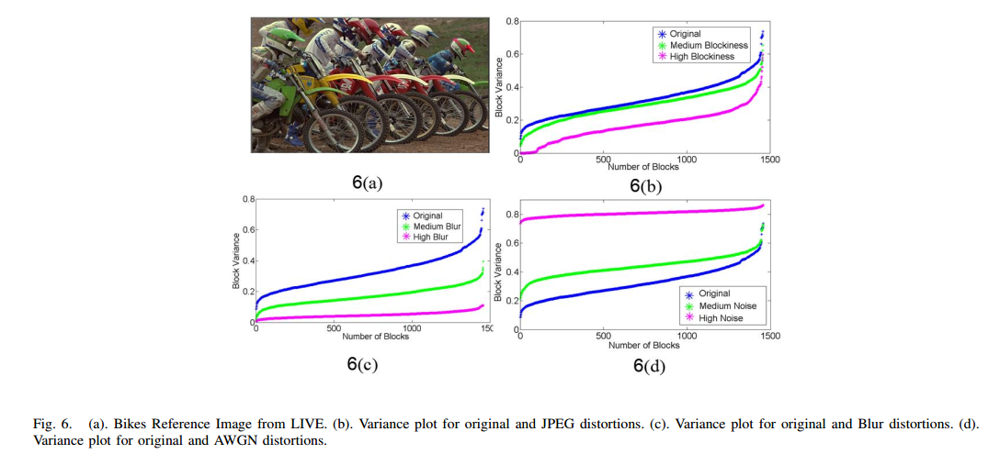

> paper:Blind Image Quality Evaluation Using Perception Based Features  
> date:2015  
> authors:Venkatanath N* etc...  
> code:[PIQE](https://github.com/buyizhiyou/NRVQA/blob/master/piqe.py)

# 1.Introduction

>Firstly, humans visual attention is highly directed towards salient points in an image or spatially active regions. Secondly, local quality at block/patch level adds up to the overall quality of an image as perceived by humans. In our approach, the first principle is addressed by estimating distortion only on regions of spatial prominence and the second, by computing distortion levels at the local block level of size n × n, where n = 16. Working at the block level would enable us to exploit the local characteristics that account for overall perceptual quality of an image.

1.主观质量评价对图像中某些显著重要的部分更为关注。2.由局部块的质量分数得到整体质量分数。
作者提出了方法Perception-based Image Quality Evaluator(PIQE)

# 2.PIQE

## A.Divisive Normalization
类似BRISQUE，先计算MSCN系数$\hat{I}(i,j)$。
将$\hat{I}(i,j)$分成$N_b$个size为$n \times n$的block(n=16)，利用$\hat{I}(i,j)$标记每一个block是uniform(U)还是spatially active(SA)。
$$
B_k=\left \{\begin{aligned} U && \nu_k<T_U \\ SA & & \nu_k \ge T_U \end{aligned} \right.
$$
其中$\nu_k$是块$B_k$　MSCN系数的方差，$k\in 1,2,\dots,N_b$, $T_U$是预设的值，作者设为0.1。下面只对SA块评估质量分数。
## B.Block Level Distortion Estimation
失真可分为三类:块效应(blockiness)，模糊(blur)，噪声(noise)。
作者对spatially active $B_k$失真分两类处理，noticeable distortion和white noise.
### 1.Noticeable Distortion Criterion
对于$n \times nB_k$的每一条$L_p$,划分为11个segment
$$
a_{pq}=L_p(x):x=q,q+1,\dots,q+5
$$
$p\in 1,2,3,4$表示四条边，$q\in 1,2,3,\dots,11$表示每条边可分割11个segment，每一segment长为5。
如果有任何一个segment标准差小于某个阈值，则是low spatial activity,视为存在noticeable distortion，即满足
$$
\sigma_{pq}<T_{STD}　\tag{1}
$$
### 2.Noise Criterion
将block划分为中心区域和周边区域，分别计算标准差为$\sigma_{cen}$和$\sigma_{sur}$,计算block的标准差为$\sigma_{blk}$
$$
\beta = \frac{\vert\frac{\sigma_{cen}}{\sigma_{sur}}-\sigma_{blk}\vert}{\max(\frac{\sigma_{cen}}{\sigma_{sur}},\sigma_{blk})}
$$

如果存在noise，则有如下关系:
$$
\sigma_{blk} > 2*\beta \tag{2}
$$

### 3.Quantifying Distortion using Block Variance Parameter
上面提出两个准则(1),(2)判断是否存在两种失真，然后作者使用block的variance来度量两种失真。
>we could observe that the variance of the MSCN coefficients of a given block, $\nu_{blk}$ shows significant signature of the amount of distortion present in that block.

### 4.Pooling
使用$v_{blk}$度量block的失真，
$$
D_{sk}=\left \{\begin{aligned} 1 && if& (1)and(2) \\ \nu_{blk} && if& (2)\\(1-\nu_{blk}) & & if& (1) \end{aligned} \right.
$$
整张图片的质量分数:
$$
PIQE=\frac{\sum_{k=1}^{N_{SA}}D_{sk}+C_1}{N_{SA}+C_1}
$$
其中$C_1$是为了数值稳定性的常数，$N_{SA}$是spatially active blocks的总数。

# 3.Experiments

