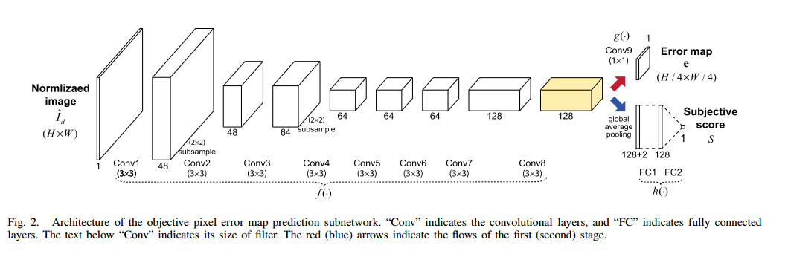

> paper:Deep CNN-Based Blind Image Quality Predictor
> authors:Jongyoo Kim etc...
> date:2018
> [code](https://github.com/buyizhiyou/NRVQA)

# 1.Introduction
CNN广泛应用于计算机视觉任务，将CNN用到IQA的一个问题是:IQA数据集较小，标注困难。作者提出第一阶段使用objective error map(失真图片和原始图片做差)作为代理训练目标，训练CNN网络,pixelwise相当于扩大了数据集；第二阶段再利用第一阶段的CNN模型fituning图片到质量分数的模型。
当图片严重失真时，失真图片缺少高频细节信息，error map就会有很多高频成分，很难从失真图片预测error map,作者提出了reliability map,认为模糊区域有低的reliability。

# 2.DIQA
## A.Image Normalization
图片预处理，$I_r$和$I_d$表示参考图片和失真图片，normalized后的用$\hat{I_r}$和$\hat{I_d}$表示。
$$
\hat{I}=I-I^{low}
$$
$I^{low}$经下面按下面处理获得:
(1)灰度化，高斯模糊　　
(2)Downscale　1/4　　
(3)Upscale到原来的尺度　　
## B.Model Architecture

## C.Reliability Map Prediction
训练预测error map的网络时，模型无法预测同质化区域(homogeneous regions)，为此提出了reliabilit function,作者假设模糊的区域有低的reliability。
$$
r=\frac{2}{1+exp(-\alpha|\hat{I_d}|)}-1
$$
上面的定义可能影响最终预测分数，用平均reliability map替代
$$
\hat{r}=\frac{1}{\frac{1}{H_rW_r}\sum_{i,j}r(i,j)}r
$$
### D.Objective Error Map
在训练的第一阶段，用objective error map作为训练的代理目标。loss函数如下:
$$
L(\hat{I_d};\theta_f,\theta_g)=||g(f(\hat{I_d;\theta_f})-e_{gt};\theta_g)\odot\hat{r}||_2^2
$$
其中$f$和$g$见上图定义，$\theta$表示网络参数，$e_{gt}$定义如下:
$$
e_{gt}=|\hat{I_r}-\hat{I_d}|^p
$$
论文设定$p=0.2$。
如上图，第一阶段的网络输出变为原尺度的1/4,所以这里计算loss时也需要对$e_{gt}$和$\hat{r}$ downscale为原尺度的1/4

### E.Learning Subjective Opinion
第二阶段训练预测图片质量分数。如上图网络结构，卷积层提取的特征送入后面连接两个fc层。在这里添加了两个额外的手工设计特征:reliability map $r$的均值$\mu_r$和低频失真图像$I_d^{low}$的标准差$\sigma_{I_d}^{low}$。loss函数如下:
$$
L_2(I_d;\theta_f,\theta_h)=||h(v,\mu_r,\sigma_{I_d}^{low};\theta_h)-S||_2^2
$$
其中S是标准的主观评分,v是池化后的特征向量:
$$
v=GAP(f(\hat{I_d};\theta_f))
$$
GAP是上面结构图里的global average pooling。
# 3.Experiments
## A.ablation studies
### 1.Pretraining with objective error map
### 2.Reliability Map
### 3.Image Normalization
### 4.Handcrafted Features
### 5.Proxy Training Targets
## B.performance
