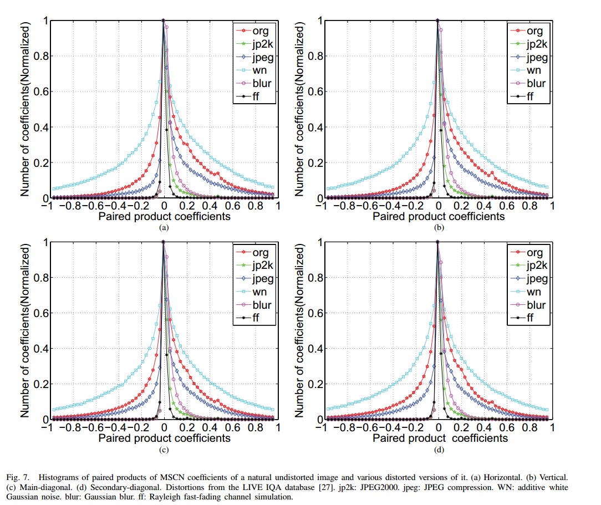
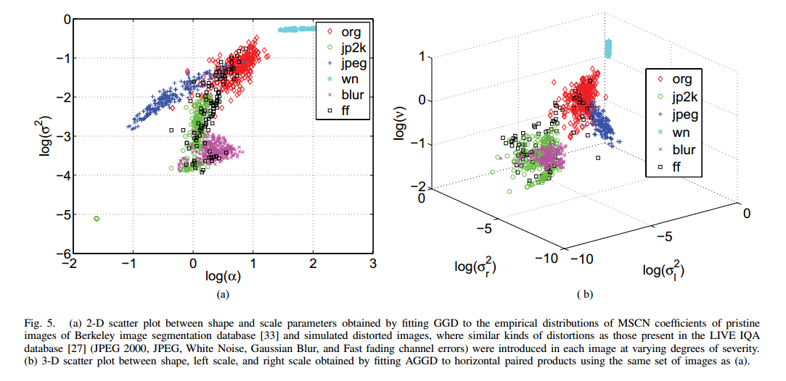
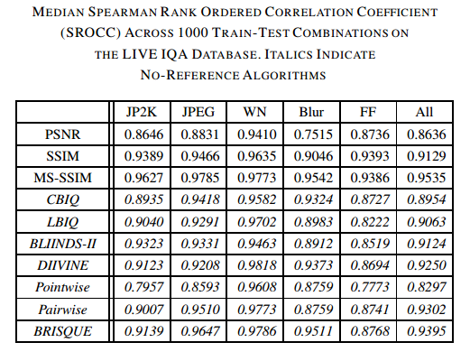

> paper:No-Reference Image Quality Assessment in the Spatial Domain  
> author:Anish Mittal etc  
> date:2012
> code:[BRISQUE](https://github.com/buyizhiyou/NRVQA/blob/master/brisque.py)
# 1.Introduction

作者提出的方法 Blind/Referenceless Image Spatial QUality Evaluator (BRISQUE)是基于自然图像的统计特征(NSS,natural scene statistics)，对于失真图像，这些特征可能会改变，据此得到了无参考图像评价的算法。这种方法是在空间域上做的(transform free)，不像之前一些算法要转换到小波域或者 DCT 域。
# 2.BRISQUE
## *A.Natural Scene Statistics in the Spatial Domain*
对于图像$I(i,j)$,经正则化得到mean subtracted contrast normalized(MSCN)系数
$$ \hat{I}(i,j)=\frac{I(i,j)-\mu(i,j)}{\sigma(i,j)+C} $$
其中,$i \in 1,2,\dots,M,j\in 1,2,\dots,N$,$M,N$是图像的高和宽，$C=1$是为了数值稳定的常数。
$$\mu(i,j)=\sum_{k=-K}^{K}\sum_{l=-L}^{L} \omega_{k,l}I_{k,l}(i,j)\\
\sigma(i,j)=\sqrt{\sum_{k=-K}^{K}\sum_{l=-L}^{L}\omega_{k,l}(I_{k,l}(i,j)-\mu(i,j))^2}
$$
其中$\omega=\{ \omega_{k,l}\vert k=-K,\dots,K,l=-L,\dots,L\}$是高斯核。

>Our hypothesis is that the MSCN coefficients have characteristic statistical properties that are changed by the presence of distortion, and that quantifying these changes will make it possible to predict the type of distortion affecting an image as well as its perceptual quality.  

   

使用generalized Gaussian distribution(GGD)建模MSCN系数直方图,
$$
f(x;\alpha,\sigma^2)=\frac{\alpha}{2\beta \Gamma(1/\alpha)}exp(-(\frac{\vert{x}\vert}{\beta})^{\alpha}) 
$$
其中
$$
\beta=\sigma\sqrt{\frac{\Gamma(1/\alpha)}{\Gamma(3/\alpha)}}\\
\Gamma(a)=\int_0^{\infty}t^{a-1}e^{-t}dt \quad a>0
$$
$GGD(\alpha,\sigma^2)$的两个参数可以使用moment-matching based approach计算出来(详见原论文)。拟合出的两个参数作为两个特征量。
另一方面，为了描述相邻像素之间的统计关系，计算相邻MSCN系数的pairwise products,共四个方向，水平(H),数值(V),主对角线(D1),次对角线(D2)，得到4个系数矩阵:
$$
H(i,j)=\hat{I}(i,j)\hat{I}(i,j+1) \\
V(i,j)=\hat{I}(i,j)\hat{I}(i+1,j)\\
D1(i,j)=\hat{I}(i,j)\hat{I}(i+1,j+1)\\
D2(i,j)=\hat{I}(i,j)\hat{I}(i+1,j-1) \\
for  \quad i\in\{1,\dots,M\} \quad and \quad j\in \{1,\dots,N\}
$$
下图显示了自然图像和不同失真下这4个矩阵的统计直方图:

用asymmetric generalized Gaussian(AGGD)distribution对以上四个系数矩阵建模。
$$
f(x;\nu,\sigma_l^2,\sigma_r^2)=\left\{
\begin{aligned}
\frac{\nu}{(\beta_l+\beta_r)\Gamma(\frac{1}{\nu})}exp(-(\frac{-x}{\beta_l})^{\nu}) & , & x<0, \\
\frac{\nu}{(\beta_l+\beta_r)\Gamma(\frac{1}{\nu})}exp(-(\frac{x}{\beta_l})^{\nu}) & , &x\ge0.
\end{aligned}
\right.  
$$
其中
$$
\beta_l=\sigma_l\sqrt{\frac{\Gamma(1/\alpha)}{\Gamma(3/\alpha)}}\\
\beta_r=\sigma_r\sqrt{\frac{\Gamma(1/\alpha)}{\Gamma(3/\alpha)}}
$$
$AGGD(\nu,\sigma_l^2,\sigma_r^2)$的3个参数可以使用moment-matching based approach计算出来(详见原论文)。
对于H,W,D1,D2四个矩阵，可以提取AGGD分布的参数$(\eta,\nu,\sigma_l^2,\sigma_r^2)$作为特征，其中
$$
\eta = (\beta_r-\beta_l)\frac{\Gamma(\frac{2}{\nu})}{\Gamma(\frac{1}{\nu})}
$$
4x4可以得到16维特征，加上GGD提取出的2个参数，共18维特征，然后对原始图像降分辨率(low pass filtered and downsampled by a factor 2)得到低尺度下的图像，再仿照上面的计算出18维特征，共36维特征。
下图显示了自然图像和不同失真图像计算出的GGD和AGGD参数在空间中的分布。

## B.Quality Evaluation
使用上面计算出的36维特征训练出一个回归分数的SVR模型，学习特征空间到质量分数的映射。

# 3.Experiments
结果如下

