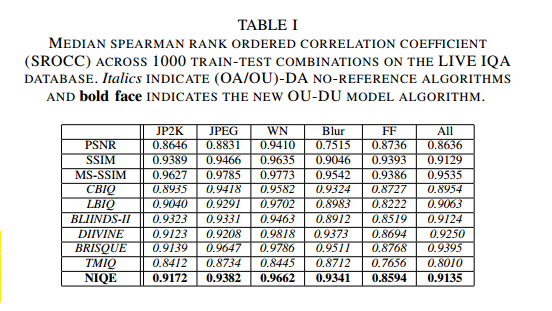
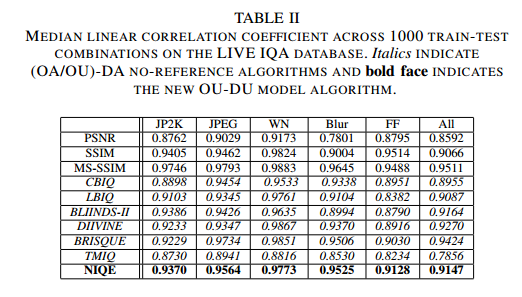

> paper:Making a Completely Blind Image Quality Analyzer
> date:2012
> author:Anish Mittal etc...
> code:[NIQE](https://github.com/buyizhiyou/NRVQA/blob/master/niqe.py)

# 1.Introduction
本文提出的方法Natural Image Quality Evaluator(NIQE)是沿袭brisque的，但是不需要在人类评分的数据集上训练，所以是"opinion unaware"，"completely blind"的。

# 2.NIQE
## A.Spatial Domain NSS
类似BRISQUE方法，提取NSS特征。对于图像$I(i,j)$,经正则化得到mean subtracted contrast normalized(MSCN)系数
$$ \hat{I}(i,j)=\frac{I(i,j)-\mu(i,j)}{\sigma(i,j)+C} $$
其中,$i \in 1,2,\dots,M,j\in 1,2,\dots,N$,$M,N$是图像的高和宽，$C=1$是为了数值稳定的常数。
$$\mu(i,j)=\sum_{k=-K}^{K}\sum_{l=-L}^{L} \omega_{k,l}I_{k,l}(i,j)\\
\sigma(i,j)=\sqrt{\sum_{k=-K}^{K}\sum_{l=-L}^{L}\omega_{k,l}(I_{k,l}(i,j)-\mu(i,j))^2}
$$
其中$\omega=\{ \omega_{k,l}\vert k=-K,\dots,K,l=-L,\dots,L\}$是高斯核。

## B.Patch Selection
>Since humans appear to more heavily weight their judgments of image quality from the sharp image regions, more salient quality measurements can be made from sharp patches.

由于人的主观评价对于图像锐利区域更为敏感，所以先提取锐利区域再计算特征。将图像划分为$P*P$个patches,利用下面规则选取锐利部分:
$$
\delta(b)=\sum\sum_{(i,j)\in patch_b}\sigma(i,j) \quad b=1,2,\dots,P*P　　\tag{1}
$$
设定阈值T,如果$\delta(b)>T$,认为$patch_b$是锐利的，选择这些patches作为计算特征的部分。

## C.Characterizing Image Patches
上面经过sharpness criterion(1)选择一些patches之后，需要提取特征，类似于BRISQUE方法拟合GGD和AGGD得到18维特征，在不同尺度下再做一次，得到36维特征。
## D.Multivatiate Gaussian Model(MVG)
MVG
$$
f_X(x_1,\dots,x_k)=\frac{1}{(2\pi)^{k/2}\vert\Sigma\vert^{1/2}}exp(-\frac{1}{2}(x-\nu)^T\Sigma^{-1}(x-\nu))
$$
其中$(x_1,\dots,x_k)$是上面计算出的36维NSS特征。$\nu,\Sigma$表示多元高斯分布的均值和协方差，作者用125张natural images拟合出$\nu,\Sigma$的值。
## E.NIQE Index
NIQE分数的计算，是通过计算待测图片MVG模型参数和上面得到的自然图片MVG模型参数的距离来得到(如下式)。不过选择patch的准则(1)不应用到待测图片上，而只用在上面自然图片模型参数估计上。原因如下:
>The sharpness criterion (1) is not applied to these patches because loss of sharpness in distorted images is indicative of distortion and neglecting them would lead to incorrect evaluation of the distortion severity. 

$$
D(\nu_1,\nu_2,\Sigma_1,\Sigma_2)=\sqrt{(\nu_1-\nu_2)^T(\frac{\Sigma_1+\Sigma_2}{2})^{-1}(\nu_1-\nu_2)}
$$

# 3.PERFORMANCE EVALUATION
测试结果:

