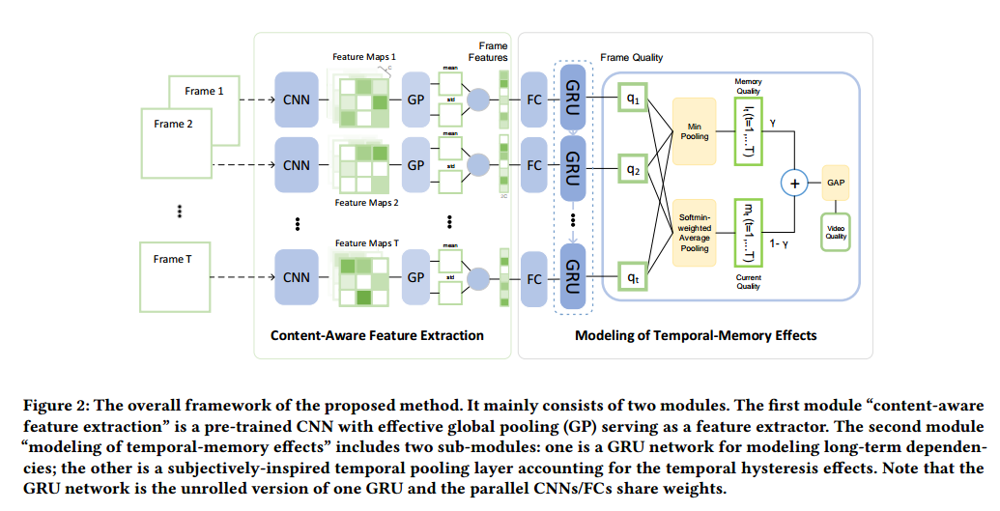
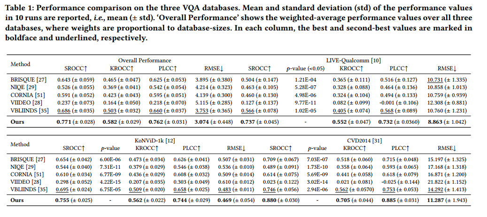

> paper:Quality Assessment of In the Wild Videos  
> authors:Dingquan Li etc.  
> date:2019  
> codes:[vsfa](https://github.com/lidq92/VSFA)

---

# 1. Introduction:

1.Human judgments of visual image/video quality depend on content：主观评价受图片内容的影响。
2.Human judgments of video quality are affected by their temporal memory.之前质量差的帧，对后续帧的评分有影响。(**temporal hysteresis effect**)  
作者提出的方法，用图像分类任务中预训练的 CNN 提取内容信息，然后用 GRU 建模时序信息，再用 temporal pooling 解决 temporal hysteresis effects。如下图:

# 2. Proposed Method

## 2.1 content-aware feature extraction

使用 ImageNet 预训练的 CNN 有识别图片内容信息的能力。  
假设视频有 T 帧，将第 t(t=1...T)帧$I_t$送入预训练的 CNN 网络，输出$M_t$
$$M_t=CNN(I_t) \tag{1}$$
其中$M_t$包含$C$个 feature maps。接着是空间池化操作，分别是 spatial global average pooling($GP_{mean}$,计算 feature map 的均值)和 global standard deviation pooling($GP_{std}$，计算 feature map 的标准差)。
$$ f_t^{mean} = GP_{mean}(M_t), \\ f_t^{std} = GP_{std}(M_t) \tag{2}$$
$f_t^{mean}$和$f_t^{std}$连接,构成 content-aware perceptual feature $f_t$
$$f_t=f_t^{mean} \oplus f_t^{std} \tag{3}$$
$\oplus$是 concatenation operator,$f_t$的长度是$2C$.

## 2.2 modeling of Temporal-Memory Effects

时序建模分为两部分，第一部分，使用 GRU 去 integrate features,建模帧间的长时间依赖,第二部分，使用 temporal pooling 对所有帧的评分池化得到视频评分。

### 2.2.1 Long-term dependencies modeling

$f_t$进入 GRU 层前，先使用 FC 层做 dimension reduction.
$$x_t=W_{f_x}f_t+b_{f_x}\tag{4}$$
$x_t(t=1,\dots,T)$被送入 GRU 层
$$h_t=GRU(x_t,h_{t-1}) \tag{5}$$
输出的$h_t$是 integrated features,用来预测 t 帧的评分$q_t$
$$q_t=W_{hq}h_t+b_{hq}\tag{6}$$

### 2.2.2 Subjectively-inspired temporal pooling

以前的一些算法计算出每一帧评分后通过直接平均池化来得到视频质量评分。考虑到**temporal hysteresis effect**,我们使用 temporal pooling.(subjects react sharply to drops in video quality and provide poor quality for such time interval,but react dully to improvements in video quality threon.)  

为了模拟主观评价对差的视频帧的敏感和hysteresis effect，对第$t$帧定义 memory qualit element $l_t$
$$l_t=q_t  , \quad for \quad t=1  \\
l_t=\min_{k \in V_{prev}} q_k , \quad for \quad t>1 \tag{7}$$ 
其中$V_{prev}=\{\max(1,t-\tau),\dots,t-2,t-1\}$是$I_t$前面的一组帧，$\tau$是和temporal duration相关的超参数.

　　
为了解释主观评价对视频质量下降的敏感和对视频质量提升的感觉迟钝，在第$t$帧定义了current quality element $m_t$，对t帧后的帧序列应用用加权平均，差的帧分配大的权重。
$$ m_t=\sum_{k\in V_{next}}q_kw_t^k \\
w_t^k=\frac{e^{-q_k}}{\sum_{j\in V_{next}e^{-q_j}}},k\in V_{next} \tag{8}$$
$V_{next}$是第$t$帧后的一组帧，$V_{next}=\{t,t+1,\dots,\min(t+\tau,T) \}$.
最后，第t帧的评价分数为$l_t$和$m_t$的加权平均，总体的视频质量分数Q是所有帧的评分的全局平均池化(GAP,即平均)
$$q_t^,=\gamma l_t+(1-\gamma)m_t  \\
Q=\frac{1}{T}\sum_{t=1}^Tq_t^,\tag{9}$$
## 2.3 Implementation Details
使用ImageNet预训练resnet50提取content-aware特征，$f_t$是4096维，接着用一个FC层降维到128,使用GRU层提取帧间long-term dependencies,GRU的hidden state size设为32,然后经temporal pooling得到视频分数,$\tau$和$\gamma$两个超参数设为12和0.5。训练使用L1 loss和Adam optimizer。
# 3 Experiments
## 3.1
datasets:KoNViD-1k/LIVE-Qualcomm/CVD2014
evaluation criteria:SROCC/KROCC/PLCC/RMSE
## 3.2 对比
与BRISQUE/NIQE/CORNIA/VIIDEO等算法对比分析

## 3.3 abalation study 

